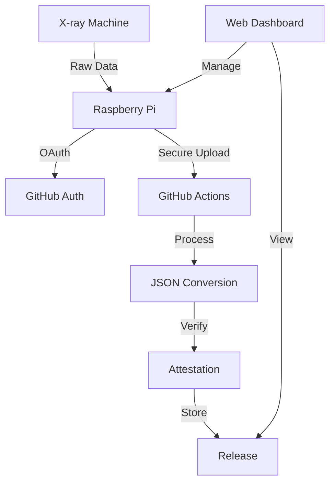

# Development Roadmap

## Current State (MVP)
- Browser based upload workflow (data/input --> data/output)
- Simple Raspberry Pi installation
```plaintext
cd /tmp && git clone -b Test-1-16 https://github.com/johntrue15/NOCTURN-Raspi-test.git && cd NOCTURN-Raspi-test && chmod +x *.sh && sudo ./install.sh
```
- Basic attestations (https://github.com/johntrue15/NOCTURN-Raspi-test/releases/tag/scan-69)

## Phase 1: Core Infrastructure
### Authentication & Security
- [ ] OAuth2 flow for Raspberry Pi setup
- [ ] Secure token management
- [ ] Rate limiting
- [ ] Access control levels
- [ ] Audit logging

### Data Processing
- [ ] Support for all GE file formats
  - [ ] .pcr (Calibration)
  - [ ] .pcp (Project)
  - [ ] .pcx (Extended)
- [ ] North Star RTF parser
- [ ] Standardized JSON schema
- [ ] Data validation
- [ ] Error correction

## Phase 2: User Experience
### Web Interface
- [ ] User dashboard
  - [ ] File upload status
  - [ ] Conversion history
  - [ ] Device management
- [ ] Real-time progress updates
- [ ] Batch processing
- [ ] Custom report generation

### Installation
- [ ] ISO image builder
  - [ ] Automated network config
  - [ ] Self-updating system
  - [ ] Recovery mode
- [ ] Web-based setup wizard
- [ ] QR code configuration

## Phase 3: Enterprise Features
### Multi-Device Management
- [ ] Fleet management
- [ ] Centralized monitoring
- [ ] Remote configuration
- [ ] Health checks
- [ ] Auto-recovery

### Data Analytics
- [ ] Machine learning for anomaly detection
- [ ] Trend analysis
- [ ] Predictive maintenance
- [ ] Custom metrics

### Integration
- [ ] REST API
- [ ] Webhooks
- [ ] Third-party integrations
  - [ ] DICOM support
  - [ ] PACS integration
  - [ ] Cloud storage providers

## Phase 4: Compliance & Scale
### Compliance
- [ ] HIPAA compliance
- [ ] GDPR compliance
- [ ] FDA requirements
- [ ] Audit trails
- [ ] Data retention policies

### Performance
- [ ] Distributed processing
- [ ] Load balancing
- [ ] Caching
- [ ] Queue management
- [ ] Database optimization

## Development Practices
### Code Quality
- [ ] 100% test coverage
- [ ] Automated testing
  - [ ] Unit tests
  - [ ] Integration tests
  - [ ] End-to-end tests
- [ ] CI/CD pipeline
- [ ] Code review process

### Documentation
- [ ] API documentation
- [ ] User guides
- [ ] Developer guides
- [ ] Architecture diagrams
- [ ] Deployment guides

### Monitoring
- [ ] Metrics collection
- [ ] Error tracking
- [ ] Performance monitoring
- [ ] Usage analytics
- [ ] SLA monitoring

## Contributing
See [CONTRIBUTING.md](../CONTRIBUTING.md) for:
- Development setup
- Code style guide
- Testing requirements
- Pull request process

## Architecture


## Timeline
1. Phase 1: Q2 2024
2. Phase 2: Q3 2024
3. Phase 3: Q4 2024
4. Phase 4: Q1 2025

## Resources
- [Project Board](https://github.com/orgs/your-org/projects/1)
- [Milestone Tracking](https://github.com/your-org/repo/milestones)
- [Design Documents](docs/design/)
- [RFC Process](docs/rfc/) 
