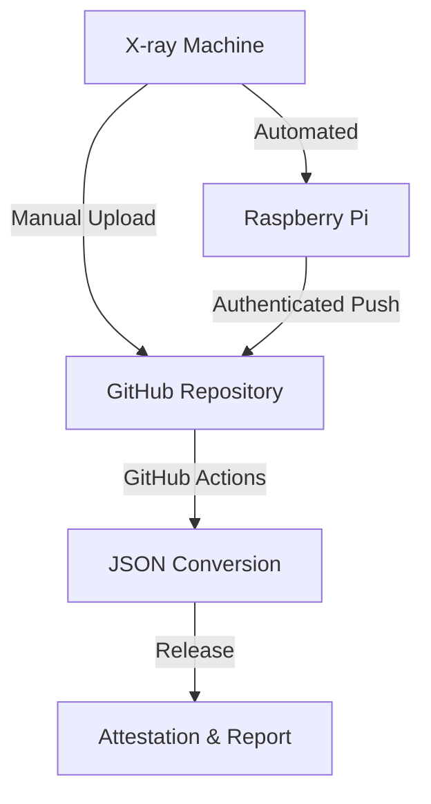

# NOCTURN X-ray Data Management System

NOCTURN is a dual-purpose system for X-ray data management:
1. **Manual Upload**: Upload X-ray log files directly to GitHub for conversion and attestation
2. **Automated Collection**: Install a Raspberry Pi for automatic data collection and upload

## Quick Links
- [Manual Upload Guide](Manual-Upload)
- [Raspberry Pi Installation](Raspi-Install)
- [Supported File Types](File-Types)
- [Understanding Attestations](Attestations)
- [FAQ](FAQ)

## System Overview
